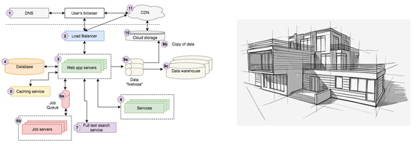
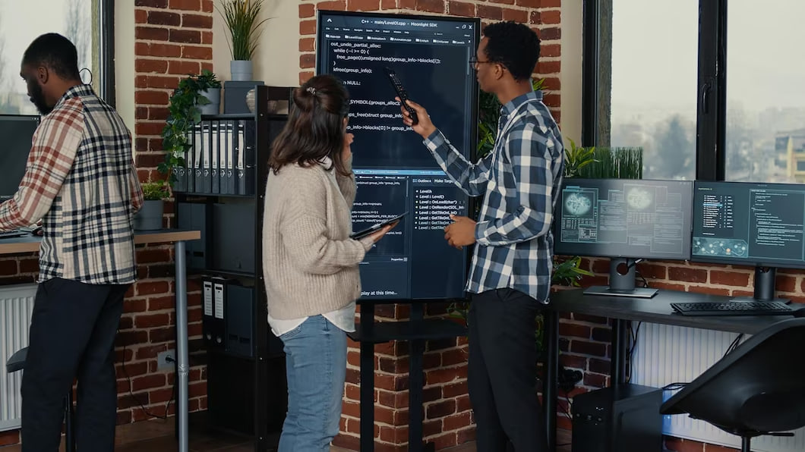

## Beginning the Never Ending Journey of Software Engineering

Never ending is absolutely right. The rapid pace of technological evolution demands perpetual learning and adaptability. That hot new technology that came out ten years ago? We've already moved on. Whatever we as software engineers feel like we know, we know that there is always more to learn. A solid foundation is key in keeping this learning strong.
As a student and someone just beginning their journey as a developer, my software engineering course, ICS 314, has taught me many of these fundamental aspects of what it means to be a software engineer.

## An Engineer's Toolbox

The most important thing I learned was that a large part of software engineering is not in the coding itself, but the organization you put into a project before even writing your first line of code. Understanding not just what tools are avaliable, but how and when to use them has been my biggest takeaway from this course.
From version control systems like Git to integrated development environments (IDEs) and linters, ICS 314 has allowed me to navigate and leverage these tools to enhance efficiency and code quality.
While I may have been familiar with these tools beforehand, it was in 314 that I got a chance to put them all into use and watch them mingle, observing which situations allow for each tool to shine. Knowing the right tool for the job is an important skill for a software engineer to have.

## The Thoughtful Architect

Another key lesson of my software engineering course was that professional code does not come automatically. Decisions must be made on how the code itself will look and behave. Organized code is good code.
Practices like coding standards and making use of design patterns were a part of our curriculum that will directly improve our coding skills. A codebase should be thought up carefully and built with structure and readability in mind, and it is practices like these which have impressed upon me how that is done.
Like an architect designing a building, a software engineer should take great care in constructing his code to be both sturdy and beautiful. Now that I have been better exposed to these practices and have had a chance to implement them into my code, I would never want to begin a project without them.

## Collaboration

One of the most profound aspects of software engineering lies in the collaborative nature of the discipline. Working within diverse teams, with each member contributing a unique skill set and perspective, will always be an enriching experience. 
Real coding is almost always a team game, and learning to work with other professionals is arguably the most important aspect of being a software engineer.
Our final group project allowed me to work with a group of professional and intelligent peers on a project that was enjoyable to create. This was also yet another opportunity to put all of the practices and tools I learned throughout the course into use. 
The lessons learned and experiences gained during this course will undoubtedly be a great asset as I enter into my never ending journey of software engineering.
