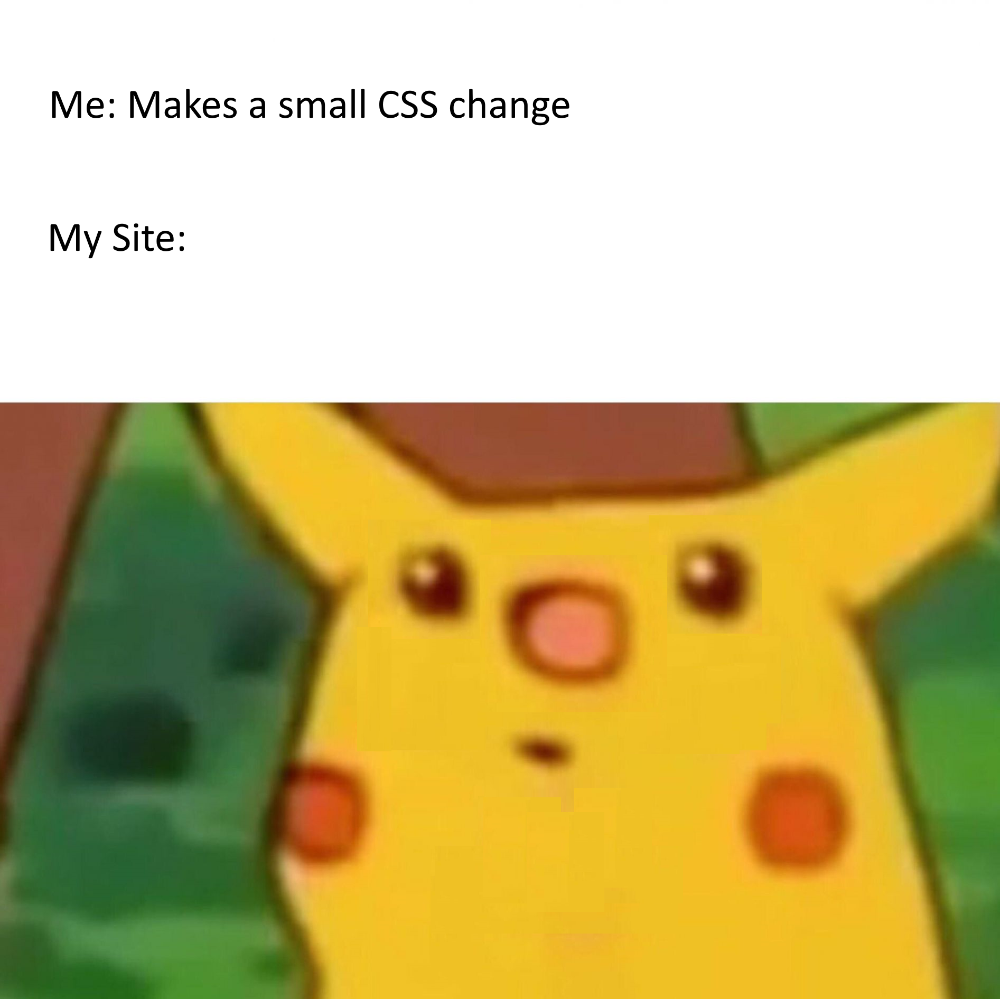

 

## \

Front-end development offers several approaches, and many frameworks are available to use. Making a front end with raw HTML and CSS is… fine. Its flexible. There is nothing wrong with it. But there are smart people who have decided to make our lives easier. UI frameworks like Bootstrap or Tailwind are essentially libraries that give us a standardized set of components and styles, like a set of templates we can combine together to make our lives easier. The benefit is that once we get comfortable with the various templates available and what they do, we can simplify our workflow. However, the key is “once we get comfortable”. These frameworks can take time to get used to, and sometimes, the templates are just as plentiful as the tools of plain CSS itself. However, in my experience, I found that once I got used to the most commonly used classes of Bootstrap, it significantly improved the efficiency of my workflow; however, I also think that a developer should not overuse it. There are most certainly situations where making a quick CSS change or getting a specific look would be more efficient done in raw CSS instead of using a framework.

At the end of the day, these front-end frameworks are tools just like any other and have a time and place. They are useful and can help one smooth their workflow, but like any tool, they take time to master and aren’t the most optimal choice for every job.
