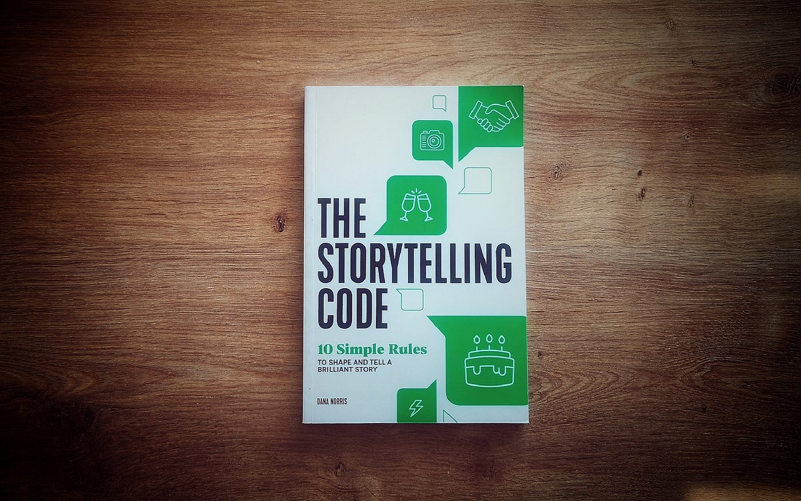

  

## Good code tells a story

A professor of mine once said that good code must tell a story. At the heart of this statement is a consistent and universal coding style. Smart variable names, well documented functions, comprehensible project documentation, and code with consistent and readable spacing allow the coder to tell a story and tell it well. 

## Miscommunication === Problems
  
My programming journey throughout high school and college has reinforced my belief that good communication is the cornerstone of an organized and efficient work environment. Supplemented with documentation, defining a coding style is the way to curate good communication in code.
Almost any open-source project now commonly includes a "contribute.md" file on their public facing git repositories. This file serves as an entry point for potential contributors, offering guidance on coding styles and documentation practices. Adding a contribute file is very low effort, and yet it has a tremendous impact on the integrity of the project as a whole.
Having a coding style is a necessity for collaborative development. Left to their own preferences, a group of developers will revert to their own unique practices and create code that is not cohesive. 
The majority of code that one writes will be read, used, or refactored by many other programmers. If the reader is confused or struggles to derive the story the original writer was trying to communicate, then progress will slow. This is code debt, and it all could have been avoided with the simple premise of an integrated universal coding style.

## Putting it into Practice

Today, the tools at our disposal make implementing and maintaining coding styles easier than ever. Most modern IDEs offer linters and style checkers that assist programmers in adhering to coding conventions. The settings are incredibly customizable to fit every team's needs and wants.
I have personally been using linters in almost all of my code for years, the most recent being ESlint for Javascript. It is a great tool and one which I love dearly. I value the ability to modify it to fit every situation and how styles can be set by project or across the entire IDE.
Linters have become my best friend, and implementing coding standards in all my projects has helped me level up my software engineering and further the level of professionalism I bring forth in my code.
