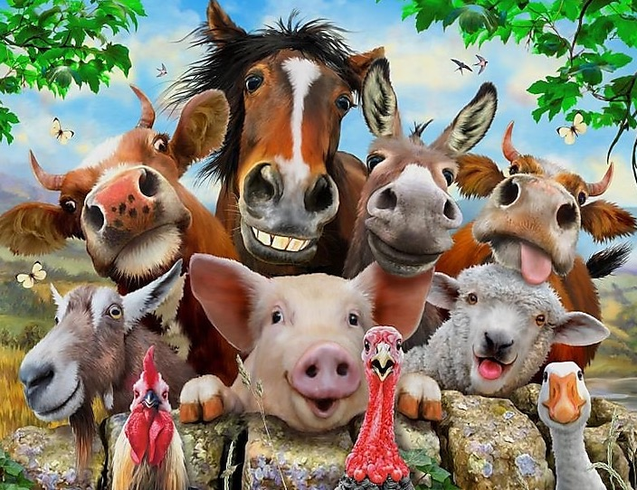

  

This project displays a farm consisting of many different types of animals, all objects that are inherited from a starting node.  

The source code is hosted publicly on github [here](https://github.com/kairemUH/ee205-Animal-Farm).  

Documentation for Animal Farm is also is posted [here](http://www2.hawaii.edu/~kairem/ee205/animalFarm/index.html) using doxygen.  
