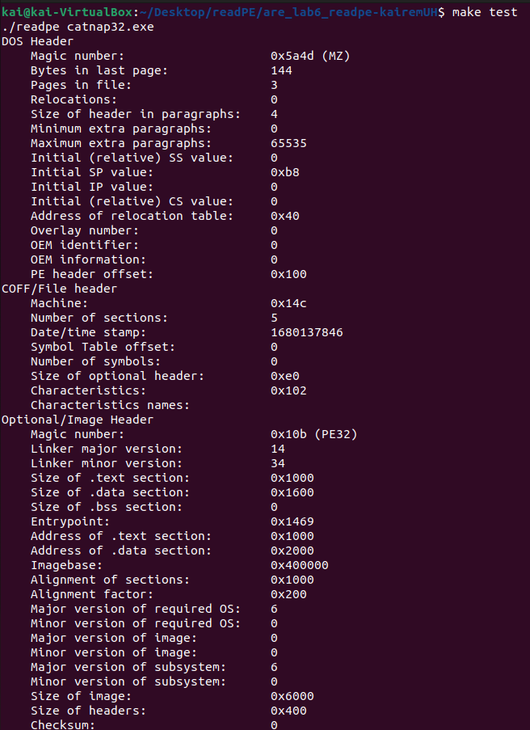

 

This project is a clone of readPE, a free program that reads and displays information about PE files (windows executables).

This project required many hours of research into the nature of Windows executables and how that file format stores data. The program is the equivalent of running ReadPE with the -H and -S options. 

The program works by taking an executable file as input through the command line, loading it into memory, and parsing through every byte of the file. It then presents the layout of the file sections and properties in a neat way to the user.

Documentation on the PE file format can be found [here](https://learn.microsoft.com/en-us/windows/win32/debug/pe-format) and [here](https://0xrick.github.io/win-internals/pe1/), which were necessary to recreate the functionality of readPE.

The source code for my clone is published on GitHub [here](https://github.com/kairemUH/readPE).
